# A/B Testing Analysis

## Table of Contents
- [Introduction](#introduction)
- [Background](#background)
  - [Dataset Source](#dataset-source)
  - [Dataset Description](#dataset-description)
- [Google Colab Notebook](#google-colab-notebook)
- [Project Overview](#project-overview)
  - [Objectives](#objectives)
  - [Statistical Tools](#statistical-tools)
- [Project Structure](#project-structure)
  - [Data Preprocessing](#data-preprocessing)
  - [Univariate Analysis](#univariate-analysis)
  - [Bivariate Analysis](#bivariate-analysis)
  - [Statistical Tests](#statistical-tests)
  - [Simulated Revenue Analysis](#simulated-revenue-analysis)
- [Insights and Interpretations](#insights-and-interpretations)
- [Conclusion](#conclusion)
  - [Project Goals](#project-goals)
  - [Limitations](#limitations)
  - [Future Steps](#future-steps)
- [Acknowledgements](#acknowledgements)


## Introduction
📊 Dive into the world of A/B testing analysis with this project! We're exploring how different user exposures—ads versus PSAs—affect conversion rates and simulated revenue. Join me in analyzing the data to derive meaningful insights that drive strategic business decisions.

## Background
### Dataset Source
The dataset used in this project was sourced from [Kaggle](https://www.kaggle.com/datasets/faviovaz/marketing-ab-testing). It comprises data related to a marketing A/B testing scenario aimed at evaluating the effectiveness of advertising campaigns. A majority of the people in the sample were exposed to ads (the experimental group), while a small portion of people (the control group) instead saw a Public Service Announcement (PSA) in the exact size and place the ad would normally be. 

### Dataset Description
The dataset contains the following columns:
- `Unnamed: 0`: Row index
- `user id`: Unique identifier for each user
- `test group`: Specifies whether the user saw an advertisement ("ad") or a Public Service Announcement ("psa")
- `converted`: Indicates whether the user made a purchase (True) or not (False)
- `total ads`: Total number of advertisements seen by each user.
- `most ads day`: Day of the week when the user viewed the highest number of advertisements
- `most ads hour`: Hour of the day when the user viewed the highest number of advertisements

## Google Colab Notebook
This [notebook](https://colab.research.google.com/drive/1muq9hceFyo-QxPNSdx73RmRMHxetpAIe?usp=drive_link) contains the Python code used for the A/B testing analysis in this project. 

The notebook includes data preprocessing steps, visualizations, statistical analysis, and simulations related to evaluating the effectiveness of advertising campaigns using A/B testing.

## Project Overview
This project focuses on conducting an A/B testing analysis to evaluate the impact of ad exposure on conversion rates and simulated revenue. The primary objective is to gain familiarity with A/B testing methodologies and leverage data analysis techniques to assess the significance of experimental results. By simulating revenue based on conversion metrics and applying rigorous statistical tests, the project aims to uncover valuable insights that can guide strategic marketing decisions. Additionally, this project offered me a valuable opportunity to demonstrate my proficiency in Python, showcasing advanced analytical skills and the ability to create impactful data visualizations using key Python packages.

### Objectives
1. Identify peak days and hours of ad exposure for users.
2. Determine the day of the week and time of day with the highest conversion rates.
3. Assess if conversion rates vary significantly based on the day or hour of ad exposure.
4. Compare conversion rates between users exposed to ads and those in the control group.
5. Explore how the number of ads seen influences conversion likelihood.
6. Analyze simulated revenue differences between users who converted and those who did not, differentiating by test group (ads vs PSA) and varying levels of total ads seen.
7. Evaluate the overall impact and effectiveness of the ad campaign, comparing revenue from ads versus PSA and examining the relationship between total ads seen and revenue.

### Statistical Tools
For my A/B testing analysis project, I utilized the following tools and platforms:

- **Python**: Used extensively for data preprocessing, statistical analysis, and creating visualizations.
- **Google Colab**: Leveraged for its cloud-based Python environment, ideal for running Jupyter notebooks and collaborating on projects.
- **Git and GitHub**: Employed for version control, enabling me to track changes, manage project iterations, and share my work with others.
- **NumPy and Pandas**: Essential Python libraries for data manipulation, allowing me to handle and analyze the dataset efficiently.
- **Matplotlib and Seaborn**: Used for data visualization, helping me create informative plots and charts to illustrate findings.
- **SciPy**: Utilized for statistical tests such as t-tests and Mann-Whitney U tests, crucial for evaluating experimental results.
  
This project enabled me to leverage my proficiency in Python programming, collaborative tools like Google Colab and GitHub, and essential data analysis and visualization libraries. These tools were instrumental in conducting rigorous A/B testing analysis and deriving meaningful insights from the dataset.

## Project Structure
  #### Data Preprocessing
   - **Loading the Libraries**: Necessary libraries for data manipulation and analysis were imported.
   - **Loading the Data**: The dataset was loaded from the provided source into a pandas DataFrame.
   - **Dropping Unnecessary Columns**: Dropped the `Unnamed: 0` column as it is just a row index and does not contribute to the analysis. Also dropped the `user id` column after confirming there were no duplicate user IDs.
   - **Checking for Missing Values**: Verified that there were no missing values in the dataset.
   - **Variable Types and Levels**: Identified the types of variables in the dataset, primarily categorical with one numerical variable. `converted` is a boolean variable (the simplest type of categorical variable), indicating whether a user made a purchase. Despite initially appearing numerical, `most ads hour` is treated categorically with 24 distinct levels, where each hour of the day is represented (e.g., 20 corresponds to 8pm). `total ads` is the sole numerical variable, representing the count of advertisements shown to each user. Ensured categorical variables had appropriate levels (e.g., 7 levels for `most ads day`, covering each day of the week; 24 levels for `most ads hour`, spanning each hour of the day). Confirmed the correct definition of levels (e.g., no entries outside the 24-hour cycle for `most ads hour`).
```python
#import basic libraries
import numpy as np
import pandas as pd
import matplotlib.pyplot as plt
import seaborn as sns

#read the data
df = pd.read_csv("marketing_AB.csv")

#check if we have duplicates with respect to user id
num_duplicates = df.duplicated(subset = 'user id').sum()

#drop unwanted columns
df.drop(['Unnamed: 0', 'user id'], axis = 1, inplace = True)

#check for missing values
any_missing = df.isnull().values.any()

#checking variable types and levels
print(df.dtypes)

#check if the categorical variables have appropriate number of levels
df_cat = df[['test group', 'converted', 'most ads day', 'most ads hour']]
df_cat.nunique()

#check if categorical variables have appropriately defined levels
for i in df_cat.columns:
  print(i.upper(), ":", df_cat[i].unique()) #gets us column names and the unique values
```

 #### Univariate Analysis

   - **Test Group**: 
     - Created a count plot and pie chart for `test group`.
     - This dataset contains over 500,000 users, with 96% shown the ad and 4% shown the PSA.
       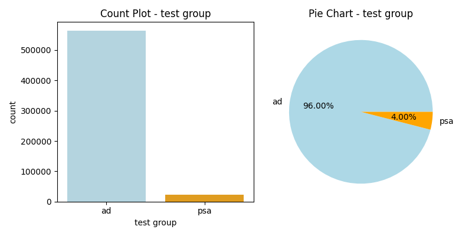

   - **Conversion Rate**: 
     - Created a count plot and pie chart for `converted`.
     - Only 2.52% of users converted (bought the product), while 97.48% did not convert, indicating a very skewed distribution. This is not unexpected when dealing with A/B testing data.
       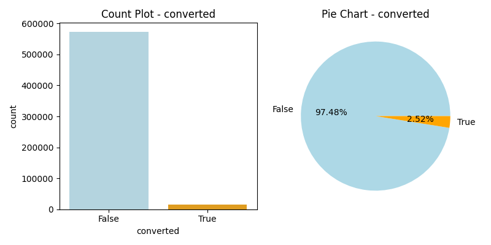

   - **Most Ads Day**: 
     - Created a count plot (ordered from highest to lowest) and a pie chart for `most ads day`.
     - Friday had the most ads shown (15.75%), while Tuesday had the fewest (13.17%). The distribution is roughly similar across all days.
     - **Objective 1 Answered**: Identified peak days of ad exposure for users.
       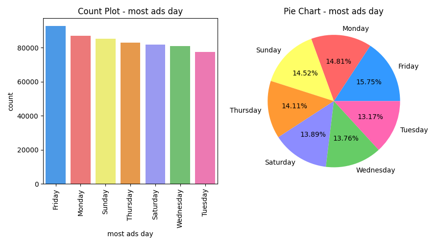

   - **Most Ads Hour**: 
     - Created a count plot (ordered from highest to lowest) and a chronological line plot for `most ads hour`.
     - The count plot and line plot revealed that 1pm had the most ads shown, while 4am had the least.
     - **Objective 1 Answered**: Identified peak hours of ad exposure for users.
       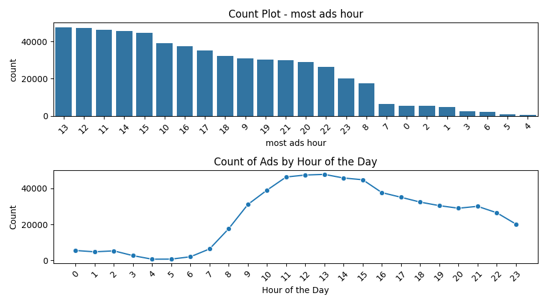

   - **Total Ads**: 
     - Created a histogram and box plot for `total ads`.
     - Due to skewness, the data was difficult to visualize, so descriptive statistics were examined:

       | Statistic     | Value        |
       |---------------|--------------|
       | count         | 588101       |
       | mean          | 24.820876    |
       | std           | 43.715181    |
       | min           | 1.000000     |
       | 25%           | 4.000000     |
       | 50%           | 13.000000    |
       | 75%           | 27.000000    |
       | max           | 2065.000000  |

     - Decided to focus on entries where the number of ads was less than 50 for better visualization.
     - Without these outliers, the median number of ads users saw was 10.

     #### Original Visualization:
     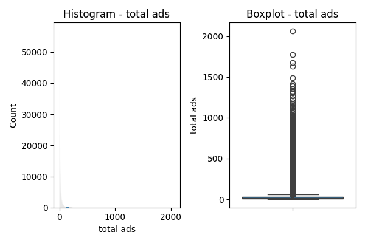

     #### Refined Visualization (less than 50 ads):
     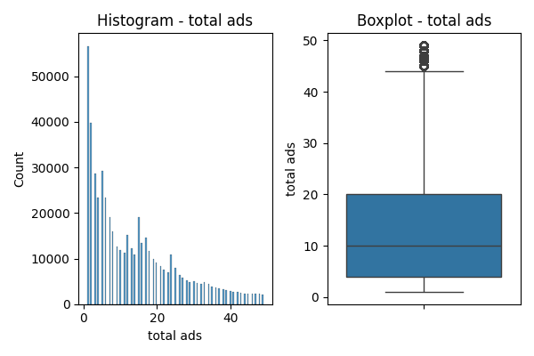


```python
#univariate analysis

#test group
variable = 'test group' #which column in df_cat to visualize
#define the custom color palette
custom_palette = {'psa': 'orange', 'ad': '#add8e6'} #light blue color code
plt.figure(figsize = (8,4))
#count plot
plt.subplot (1,2,1) #1 row, 2 col, 1st plot
sns.countplot(x=variable, data=df_cat, palette = custom_palette)
plt.title(f'Count Plot - {variable}')
#pie chart
plt.subplot(1,2,2)
counts = df_cat[variable].value_counts() #counts of each unique variable in column we are visualizing
colors = [custom_palette[label] for label in counts.index]
plt.pie(counts, labels = counts.index, autopct = '%0.2f%%', colors = colors) #percentage with 2 decimal places
plt.title(f'Pie Chart - {variable}')
#adjust layout
plt.tight_layout()
#show the plots
plt.show()

#converted
variable = 'converted' #which column in df_cat to visualize
#ensure the values in 'converted' are strings, as the custom palette keys are strings
df_cat[variable] = df_cat[variable].astype(str)
#define the custom color palette
custom_palette = {'True': 'orange', 'False': '#add8e6'} #light blue color code
plt.figure(figsize = (8,4))
#count plot
plt.subplot (1,2,1) #1 row, 2 col, 1st plot
sns.countplot(x=variable, data=df_cat, palette = custom_palette)
plt.title(f'Count Plot - {variable}')
#pie chart
plt.subplot(1,2,2)
counts = df_cat[variable].value_counts() #counts of each unique variable in column we are visualizing
colors = [custom_palette[label] for label in counts.index]
plt.pie(counts, labels = counts.index, autopct = '%0.2f%%', colors = colors) #percentage with 2 decimal places
plt.title(f'Pie Chart - {variable}')
#adjust layout
plt.tight_layout()
#show the plots
plt.show()

#most ads day
variable = 'most ads day' #which column in df_cat to visualize
#define the custom color palette
custom_palette = {
    'Monday': '#FF6666',    # Red
    'Tuesday': '#FF66B2',   # Pink
    'Wednesday': '#66CC66', # Green
    'Thursday': '#FF9933',  # Orange
    'Friday': '#3399FF',    # Blue
    'Saturday': '#8C8CFF',  # Purple
    'Sunday': '#FFFF66'     # Yellow
}
plt.figure(figsize = (9,5))
#count plot
plt.subplot (1,2,1) #1 row, 2 col, 1st plot
sns.countplot(x=variable, data=df_cat, palette= custom_palette, 
              order = df_cat['most ads day'].value_counts().index) #highest to lowest
plt.title(f'Count Plot - {variable}')
plt.xticks(rotation = 90) #rotate day names for easier reading
#pie chart
plt.subplot(1,2,2)
counts = df_cat[variable].value_counts() #counts of each unique variable in column we are visualizing
colors = [custom_palette[label] for label in counts.index]
plt.pie(counts, labels = counts.index, autopct = '%0.2f%%', colors = colors) #percentage with 2 decimal places
plt.title(f'Pie Chart - {variable}')
#adjust layout
plt.tight_layout()
#show the plots
plt.show()

#most ads hour
variable = 'most ads hour'  #which column in df_cat to visualize
#define the custom color palette (adjust as needed)
custom_palette = ['#1f77b4'] * 24  #using a single color for all bars
plt.figure(figsize=(9, 5))  # 12, 6
#count plot
plt.subplot(2, 1, 1)  # 2 rows, 1 column, 1st plot
sns.countplot(x=variable, data=df_cat, palette=custom_palette, 
              order=df_cat['most ads hour'].value_counts().index)  #highest to lowest
plt.title(f'Count Plot - {variable}')
plt.xticks(rotation=45)  #rotate hour names for easier reading
#line plot
plt.subplot(2, 1, 2)  # 2 rows, 1 column, 2nd plot
sns.lineplot(x=range(24), y=df_cat.groupby(variable).size(), marker='o', color='#1f77b4')
plt.title(f'Count of Ads by Hour of the Day')
plt.xlabel('Hour of the Day')
plt.ylabel('Count')
#customize x-axis ticks and labels
plt.xticks(range(24), labels=[str(i) for i in range(24)], rotation=45)
#adjust layout
plt.tight_layout()
#show the plots
plt.show()


#total ads
variable = 'total ads' #the only numerical variable
plt.figure(figsize = (6,4))
#histogram
plt.subplot(1,2,1)
sns.histplot(x=variable, data=df)
plt.title(f'Histogram - {variable}')
#box plot chart
plt.subplot(1,2,2)
sns.boxplot(y = variable, data = df)
plt.title(f'Boxplot - {variable}')
#adjust layout
plt.tight_layout()
#show the plots
plt.show()

#descriptive stats for total ads
df['total ads'].describe()

#second total ads visualizations (focus on entries where the number of ads is less than 50)
variable = 'total ads' #the only numerical variable
plt.figure(figsize = (6,4))
#histogram
plt.subplot(1,2,1)
#filtering the data for a value close to 75th percentile only for better visualization
sns.histplot(x=variable, data=df[df['total ads']<50])
plt.title(f'Histogram - {variable}')
#pie chart
plt.subplot(1,2,2)
sns.boxplot(y = variable, data=df[df['total ads']<50])
plt.title(f'Boxplot - {variable}')
#adjust layout
plt.tight_layout()
#show the plots
plt.show()
```
 #### Bivariate Analysis

   - **Test Group vs Converted**: 
     - Investigated the relationship between `test group` and `converted`.
     - Normalized a crosstab to show percentages. Among users exposed to the ad, 2.55% made a purchase, while among those exposed to the PSA, only 1.79% converted.
     - **Objective 4 Answered**: Compared conversion rates between users exposed to ads and those in the control group (PSA).
       
       | Test Group | Not Converted   | Converted      |
         |--------------|---------|-----------|
         | Ad      | 0.974453| 0.025547  |
         | PSA      | 0.982146| 0.017854 |
       
       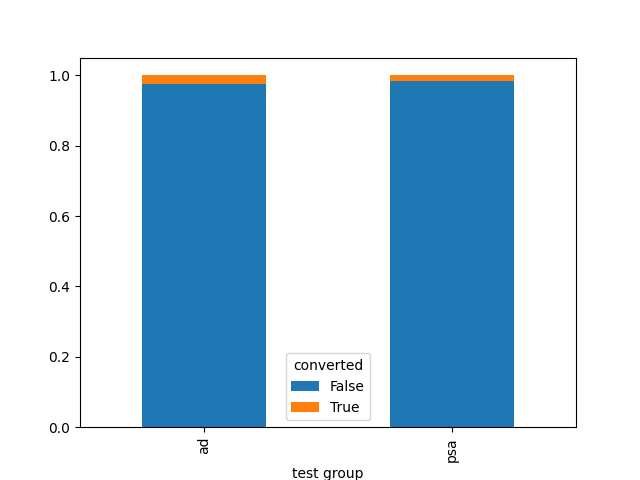

   - **Most Ads Day vs Converted**: 
     - Investigated the relationship between `most ads day` and `converted`.
     - Created a crosstab and normalized it to show percentages. Monday showed the highest conversion rate at 3.28%.
     - **Objective 2 Answered**: Determined the day of the week with the highest conversion rate.

         | Most Ads Day | Not Converted   | Converted      |
         |--------------|---------|-----------|
         | Monday       | 0.967188| 0.032812  |
         | Tuesday      | 0.970160| 0.029840  |
         | Wednesday    | 0.975058| 0.024942  |
         | Sunday       | 0.975524| 0.024476  |
         | Friday       | 0.977788| 0.022212  |
         | Thursday     | 0.978429| 0.021571  |
         | Saturday     | 0.978949| 0.021051  |

       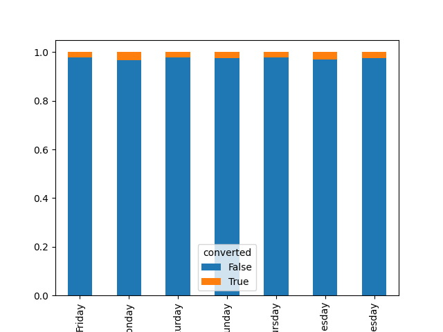

   - **Most Ads Hour vs Converted**: 
     - Investigated the relationship between `most ads hour` and `converted`.
     - Created a crosstab and normalized it to show percentages. 4pm had the highest conversion rate at 3.08%.
     - **Objective 2 Answered**: Determined the time of day with the highest conversion rate.
       
       | Most Ads Hour | Not Converted   | Converted      |
         |--------------|---------|-----------|
         | 16             | 0.969228  | 0.030772  |
         | 20             | 0.970197  | 0.029803  |
         | 15             | 0.970347  | 0.029653  |
         | 21             | 0.971077  | 0.028923  |
         | 17             | 0.971790  | 0.028210  |
         | 14             | 0.971937  | 0.028063  |
         | 18             | 0.972620  | 0.027380  |
         | 19             | 0.973280  | 0.026720  |
         | 22             | 0.973895  | 0.026105  |
         | 13             | 0.975323  | 0.024677  |
         | 12             | 0.976172  | 0.023828  |
         | 23             | 0.977338  | 0.022662  |
         | 6              | 0.977756  | 0.022244  |
         | 11             | 0.977884  | 0.022116  |
         | 10             | 0.978479  | 0.021521  |
         | 5              | 0.979085  | 0.020915  |
         | 8              | 0.980484  | 0.019516  |
         | 9              | 0.980809  | 0.019191  |
         | 0              | 0.981575  | 0.018425  |
         | 7              | 0.981889  | 0.018111  |
         | 4              | 0.984765  | 0.015235  |
         | 1              | 0.987089  | 0.012911  |
         | 3              | 0.989548  | 0.010452  |
         | 2              | 0.992687  | 0.007313  |
       
       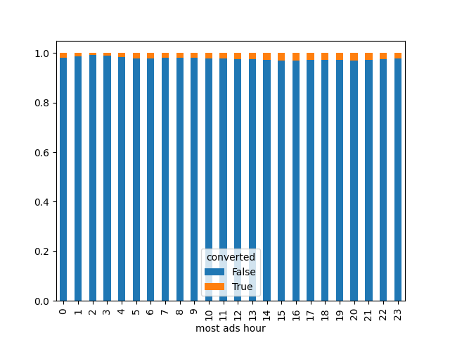

   - **Total Ads vs Converted**: 
     - Investigated the relationship between `total ads` and `converted`.
     - Created a boxplot to compare distributions. Filtered for ads less than 50 due to visualization issues identified earlier. For users who converted, the median number of ads seen was around 25, compared to 10 for those who did not convert. Repeated targetting seems to be helping with conversion rates.
     - **Objective 5 Answered**: Explored how the number of ads seen influenced conversion likelihood.
       #### Original Visualization
       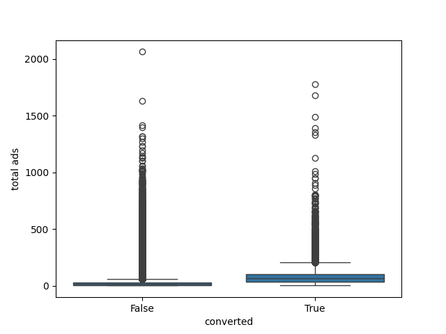
       #### Refined Visualization (less than 50 ads):
       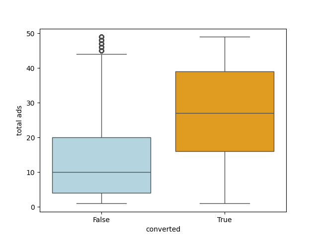

```python
#bivariate analysis

#test group vs converted
#comparing two categorical variables
#also normalized them
ct_conversion_test_group = pd.crosstab(df['test group'], df['converted'], normalize = 'index')
ct_conversion_test_group
#visualizing above
ct_conversion_test_group.plot.bar(stacked = True);

#most ads day vs converted
ct_conversion_day = pd.crosstab(df['most ads day'], df['converted'], normalize = 'index')
print(ct_conversion_day.sort_values(by = True, ascending = False))
ct_conversion_day.plot.bar(stacked = True);
plt.tight_layout()

#most ads hour vs converted
ct_conversion_hour = pd.crosstab(df['most ads hour'], df['converted'], normalize = 'index')
print(ct_conversion_hour.sort_values(by = True, ascending = False))
ct_conversion_hour.plot.bar(stacked = True);

#total ads vs converted
sns.boxplot(x = 'converted', y = 'total ads', data = df);

#total ads less than 50 vs converted
#define the custom color palette
custom_palette = {'True': 'orange', 'False': '#add8e6'}  # Light blue color code
sns.boxplot(x = 'converted', y = 'total ads', data = df[df['total ads']<50], palette = custom_palette);
```

#### Statistical Tests

- **Chi-Square Tests for Categorical Variables**
  - Conducted Chi-Square tests to examine the dependency between categorical variables and conversion status.
  - Created contingency tables (cross-tabulations) for each categorical variable against the conversion status.
  - Performed Chi-Square tests on these contingency tables.
  - Evaluated the p-values to determine the statistical significance of the relationships.

- **Findings:**
  - **Test Group:**
    - The p-value was extremely close to zero, indicating that the difference in conversion rates across `test group` is statistically significant.
    - **Objective 4 Answered**: Compared conversion rates between the users exposed to ads and those in the control group (PSA), and determined a significant difference.
  - **Most Ads Day:**
    - The p-value was extremely close to zero, suggesting that the difference in conversion rates across `most ads day` is statistically significant.
    - **Objective 3 Answered**: Assessed that conversion rates do vary significantly based on the day of ad exposure.
  - **Most Ads Hour:**
    - The p-value was extremely close to zero, suggesting that the difference in conversion rates across `most ads hour` is statistically significant.
    - **Objective 3 Answered**: Assessed that conversion rates do vary significantly based on the hour of ad exposure. 

- **Tests for Continuous Variable (Total Ads)**
  - **Check Assumptions**:
    - Conducted Shapiro-Wilk tests for normality on the `total ads` variable for both converted and non-converted groups.
    - Conducted Levene's test for equality of variances between the two groups.
  - **Perform Suitable Test**:
    - If assumptions of normality and equality of variances were met, performed a t-test for means.
    - If assumptions were not met, performed a Mann-Whitney U test for medians (nonparametric).

- **Findings:**
  - The Shapiro-Wilk test for normality returned p-values of 0.0 and 0.0 for the converted and non-converted groups, respectively, indicating non-normality of the `total ads` distribution within both groups.
  - Levene's test for equality of variances returned a p-value of 0.0, suggesting that the variances of `total ads` between the converted and non-converted groups are significantly different.
  - Since the assumptions for parametric tests were not met, a Mann-Whitney U test was performed. The resulting p-value was 0.0, indicating a significant difference in median `total ads` between users who converted and those who did not. This suggests that the number of ads seen influences conversion likelihood, as users who converted were exposed to a significantly different median number of ads compared to those who did not.
  - **Objective 5 Answered**: Explored how the number of ads seen influenced conversion likelihood.

```python
#Chi-Square tests for categorical variables
from scipy.stats import chi2_contingency
alpha = 0.05
for variable in df_cat.columns:
    if variable != 'converted':  # Don't want to see converted relationship with itself
        #create a contingency table (cross-tabulation)
        contingency_table = pd.crosstab(df_cat[variable], df_cat['converted'])
        #perform Chi-Square test
        chi2, p, _, _ = chi2_contingency(contingency_table)
        #display the results
        print(f"\nChi-Squared test for {variable} vs. converted:")
        print(f"Chi-Squared value: {chi2}")
        print(f"p-value: {p}")
        #check for significance
        if p < alpha:
            print(f"The difference in conversion rates across {variable} is statistically significant.")
        else:
            print(f"There is no significant difference in conversion rates across {variable}.")

#tests for continuous variable (total ads)
from scipy.stats import shapiro, levene, ttest_ind, mannwhitneyu
#Shapiro-Wilk test for normality
shapiro_stat_true, shapiro_p_value_true = shapiro(df[df['converted'] == True]['total ads'])
shapiro_stat_false, shapiro_p_value_false = shapiro(df[df['converted'] == False]['total ads'])
print(f"Shapiro-Wilk test for normality (True group): p-value = {shapiro_p_value_true}")
print(f"Shapiro-Wilk test for normality (False group): p-value = {shapiro_p_value_false}")
#Levene's test for equality of variances
levene_stat, levene_p_value = levene(df[df['converted']]['total ads'], df[~df['converted']]['total ads'])
print(f"Levene's test for equality of variances: p-value = {levene_p_value}")
#perform suitable test based on assumptions
alpha = 0.05
if shapiro_p_value_true > alpha and shapiro_p_value_false > alpha and levene_p_value > alpha:
    #assumptions met - use t-test for means
    t_stat, t_p_value = ttest_ind(df[df['converted']]['total ads'], df[~df['converted']]['total ads'])
    print(f"Independent two-sample t-test: p-value = {t_p_value}")
else:
    #assumptions not met - use Mann-Whitney U test for medians (nonparametric)
    u_stat, u_p_value = mannwhitneyu(df[df['converted']]['total ads'], df[~df['converted']]['total ads'])
    print(f"Mann-Whitney U test: p-value = {u_p_value}")
```

#### Simulated Revenue Analysis

- **Data Modification:**
  - Enhanced A/B testing analysis by integrating revenue simulation to augment the interpretation of data with actionable financial insights.
  - Implemented a  strategy to simulate revenue, combining a fixed base revenue for conversions and a variable component based on the number of ads seen. Previous analysis has shown that conversion rates vary depending on the type of exposure (ad vs PSA), highlighting the significant impact of ad exposure on conversion likelihood. This method ensured that the new `simulated_revenue` column in the data frame reflected the potential revenue impact of ad exposure.
  - Calculated total earnings for each group to validate the accuracy of simulated revenue calculations (Total earnings from converted users: $3,974,592.00; Total earnings from non-converted users: $0.00).

- **Univariate Analysis:**
  - Examined the distribution of `simulated_revenue` with a histogram. The right-skewed distribution shows a significant number of zeros, aligning with the low conversion rate of 2.52%. 
    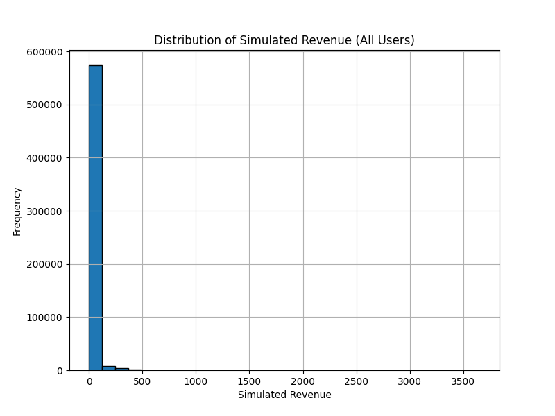 

- **Bivariate Analysis:**
  
   - **Simulated Revenue vs Converted**: 
     - Investigated the relationship between `simulated_revenue` and `converted` through the creation of histograms.
     - Due to skewness, the data was difficult to visualize, so descriptive statistics were examined.
     - Noticed that zeros were not showing up clearly for non-converted users in the combined histogram.
     - Decided to separate the histograms for non-converted and converted users for better visualization:
       - A histogram for non-converted users appropriately showed a high frequency of zero revenue.
       - A histogram for converted users was filtered to focus on entries with simulated revenue less than $350, based on examining descriptive statistics, to improve visual clarity and focus on the majority of the data.
     - Without these outliers, the average simulated revenue for converted users was $212.
       #### Original Visualization of Both Converted and Non-Converted
       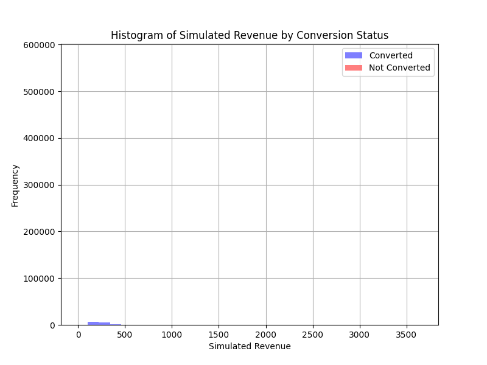
       #### Non-Converted User Visualization
       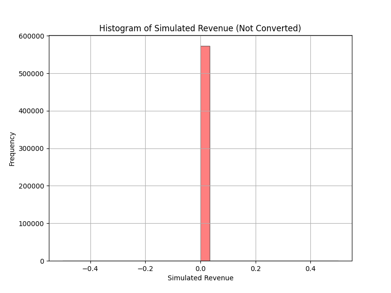
       #### Converted User Visualization (Filtered for Revenue less than $350)
       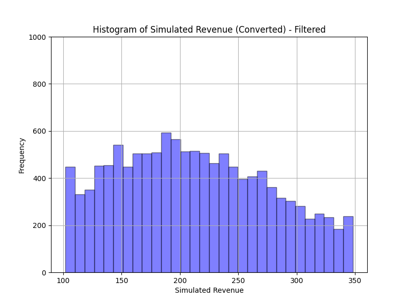
       
   - **Simulated Revenue vs Test Group**: 
     - Investigated the relationship between `simulated_revenue` and `test group` through the creation of a boxplot.
     - Due to a high percentage of zero revenue for both groups, the data was difficult to visualize, so total revenue was calculated for each group instead (Total earnings from PSA (control) group: $111,952; Total earnings from Ad (experimental) group: $3,862,640).
     - **Objective 7 Answered**: Evaluated the overall impact and effectiveness of the ad campaign by comparing revenue from ads versus PSA groups. Ad exposure clearly generated more revenue, suggesting ad campaign success.
       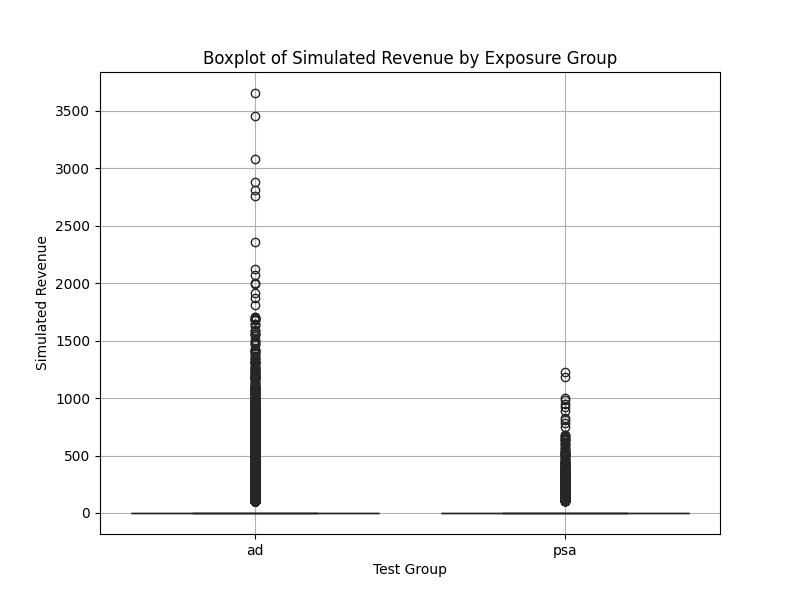
       
   - **Simulated Revenue vs Total Ads**: 
     - Investigated the relationship between `simulated_revenue` and `test group` through the creation of a scatterplot.
     - Despite a high percentage of zero values, the scatterplot revealed a positive relationship between `total ads` and `simulated_revenue` for non-zero values.
       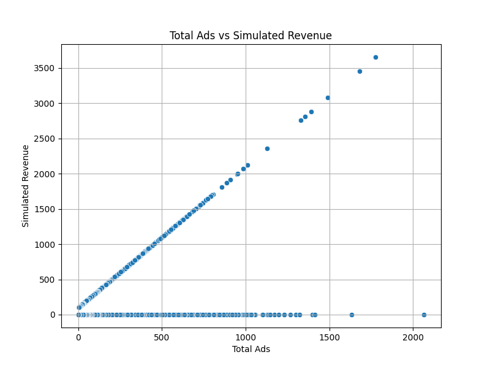

- **Statistical Tests:**
  - **Simulated Revenue vs. Converted:**
    - **Assumptions Check:**
      - Conducted Shapiro-Wilk tests for normality on the `simulated_revenue` variable for both converted and non-converted groups.
      - Shapiro-Wilk test p-values:
        - Converted group: p-value = 0.0, indicating non-normality.
        - Non-converted group: p-value = 1.0, indicating normality.
      - Conducted Levene's test for equality of variances between the two groups.
      - Levene's test p-value = 0.0, suggesting significantly different variances.
    - **Test Performed:**
      - Due to non-normality in the converted group and differing variances, used Mann-Whitney U test for medians (nonparametric).
    - **Findings:**
      - Mann-Whitney U test showed a significant difference in median `simulated_revenue` between converted and non-converted groups (p-value = 0.0).
      - **Objective 6 Answered**: Analyzed simulated revenue differences between users who converted and those who did not. Conversion significantly impacted simulated revenue, as expected, based on how the revenue was simulated.

  - **Simulated Revenue vs. Test Group (Ad vs PSA):**
    - **Assumptions Check:**
      - Conducted Shapiro-Wilk tests for normality.
      - Conducted Levene's test for equality of variances.
    - **Test Performed:**
      - If assumptions met, used t-test for means.
      - If assumptions not met, used Mann-Whitney U test.
    - **Findings:**
      - Shapiro-Wilk tests indicated non-normality (p-values = 0.0).
      - Levene's test indicated unequal variances (p-value ≈ 0.0).
      - Mann-Whitney U test showed significant difference in median `simulated_revenue` (p-value ≈ 0.0).
      - **Objective 6 Answered**: Analyzed simulated revenue differences across test group (ads vs PSA). Ad exposure significantly impacted simulated revenue, as was suggested by the total earnings differences identified in the previous bivariate analysis of `simulated_revenue` vs `test group`.

  - **Simulated Revenue vs. Total Ads Seen:**
    - **Assumptions Check:**
      - Conducted Shapiro-Wilk tests for normality.
      - Both `total ads` and `simulated_revenue` variables showed normal distribution.
    - **Test Performed:**
      - Pearson correlation was used to measure the linear relationship.
    - **Findings:**
      - Pearson correlation coefficient: 0.357, p-value = 0.000.
      - This indicates a moderate positive linear relationship between the number of total ads seen and the simulated revenue generated.
      - **Objective 6 and 7 Answered**: Analyzed simulated revenue differences between varying levels of total ads seen. Increased ad exposure lead to higher simulated revenue, as was suggested by the scatterplot of `simulated_revenue` and `total ads` highlighted in the previous section, and is indicative of ad campaign success.

```python
#data modification
#simulated revenue
#set a random seed for reproducibility
np.random.seed(45)
#define revenue parameters
fixed_revenue_per_conversion = 100
variable_revenue_per_ad = 2
#calculate simulated_revenue based on conversion status and total ads seen
df['simulated_revenue'] = df.apply(
    lambda row: fixed_revenue_per_conversion + (variable_revenue_per_ad * row['total ads']) if row['converted'] else 0,
    axis=1
)

#calculate total earnings based on conversion status
total_earnings_converted = df[df['converted']]['simulated_revenue'].sum()
total_earnings_not_converted = df[~df['converted']]['simulated_revenue'].sum()
#summary of total earnings
print(f"Total earnings from converted users: ${total_earnings_converted:.2f}")
print(f"Total earnings from non-converted users: ${total_earnings_not_converted:.2f}")

#set the figure size for all plots
plt.figure(figsize=(8, 6))

#univariate analysis
#histogram for overall simulated revenue
plt.hist(df['simulated_revenue'], bins=30, edgecolor='black')
plt.xlabel('Simulated Revenue')
plt.ylabel('Frequency')
plt.title('Distribution of Simulated Revenue (All Users)')
plt.grid(True)
plt.show()

#bivariate analysis
#histogram for simulated revenue by conversion status
plt.figure(figsize=(8, 6))
plt.hist(df[df['converted']]['simulated_revenue'], bins=30, alpha=0.5, color='blue', label='Converted')
plt.hist(df[~df['converted']]['simulated_revenue'], bins=30, alpha=0.5, color='red', label='Not Converted')
plt.xlabel('Simulated Revenue')
plt.ylabel('Frequency')
plt.title('Histogram of Simulated Revenue by Conversion Status')
plt.legend()
plt.grid(True)
#plt.savefig('simulated_revenue_converted.png')
plt.show()

#separate plot for non-converted
plt.figure(figsize=(8, 6))
plt.hist(df[~df['converted']]['simulated_revenue'], bins=30, alpha=0.5, color='red', edgecolor='black')
plt.xlabel('Simulated Revenue')
plt.ylabel('Frequency')
plt.title('Histogram of Simulated Revenue (Not Converted)')
plt.grid(True)
plt.show()

#separate plot for converted with filters
plt.figure(figsize=(8, 6))
filtered_data = df[(df['simulated_revenue'] < 350) & (df['converted'])]
plt.hist(filtered_data['simulated_revenue'], bins=30, alpha=0.5, color='blue', edgecolor='black')
plt.ylim(0, 1000)
plt.xlabel('Simulated Revenue')
plt.ylabel('Frequency')
plt.title('Histogram of Simulated Revenue (Converted) - Filtered')
plt.grid(True)
plt.show()

#boxplot of simulated revenue by exposure group
plt.figure(figsize=(8, 6))
sns.boxplot(x='test group', y='simulated_revenue', data=df, palette=['green', 'orange'])
plt.xlabel('Test Group')
plt.ylabel('Simulated Revenue')
plt.title('Boxplot of Simulated Revenue by Exposure Group')
plt.grid(True)
plt.show()

#scatterplot of total ads vs simulated revenue
plt.figure(figsize=(8, 6))
sns.scatterplot(x='total ads', y='simulated_revenue', data=df)
plt.title('Total Ads vs Simulated Revenue')
plt.xlabel('Total Ads')
plt.ylabel('Simulated Revenue')
plt.grid(True)
plt.show()

###statistical tests
#simulated revenue vs converted
#atep 1: check assumptions
#normality assumption (Shapiro-Wilk test)
shapiro_stat_true, shapiro_p_value_true = shapiro(df[df['converted'] == True]['simulated_revenue'])
shapiro_stat_false, shapiro_p_value_false = shapiro(df[df['converted'] == False]['simulated_revenue'])
print(f"Shapiro-Wilk test for normality (True group): p-value = {shapiro_p_value_true}")
print(f"Shapiro-Wilk test for normality (False group): p-value = {shapiro_p_value_false}")
#equality of variances assumption (Levene's test)
levene_stat, levene_p_value = levene(df[df['converted']]['simulated_revenue'], df[~df['converted']]['simulated_revenue'])
print(f"Levene's test for equality of variances: p-value = {levene_p_value}")
#step 2: perform a suitable test
alpha = 0.05  #adjust alpha based on your significance level
if shapiro_p_value_true > alpha and shapiro_p_value_false > alpha and levene_p_value > alpha:
    #assumptions met - use t-test for means
    t_stat, t_p_value = ttest_ind(df[df['converted']]['simulated_revenue'], df[~df['converted']]['simulated_revenue'])
    print(f"Independent two-sample t-test: p-value = {t_p_value}")
else:
    #assumptions not met - use Mann-Whitney U test for medians (nonparametric)
    u_stat, u_p_value = mannwhitneyu(df[df['converted']]['simulated_revenue'], df[~df['converted']]['simulated_revenue'])
    print(f"Mann-Whitney U test: p-value = {u_p_value}")

#simulated revenue vs test group
#step 1: check assumptions
#normality assumption (Shapiro-Wilk test)
shapiro_stat_ad, shapiro_p_value_ad = shapiro(df[df['test group'] == 'ad']['simulated_revenue'])
shapiro_stat_psa, shapiro_p_value_psa = shapiro(df[df['test group'] == 'psa']['simulated_revenue'])
print(f"Shapiro-Wilk test for normality (ad group): p-value = {shapiro_p_value_ad}")
print(f"Shapiro-Wilk test for normality (psa group): p-value = {shapiro_p_value_psa}")
#equality of variances assumption (Levene's test)
levene_stat, levene_p_value = levene(df[df['test group'] == 'ad']['simulated_revenue'], df[df['test group'] == 'psa']['simulated_revenue'])
print(f"Levene's test for equality of variances: p-value = {levene_p_value}")
#step 2: perform a suitable test
alpha = 0.05  #adjust alpha based on your significance level
if shapiro_p_value_ad > alpha and shapiro_p_value_psa > alpha and levene_p_value > alpha:
    #assumptions met - use t-test for means
    t_stat, t_p_value = ttest_ind(df[df['test group'] == 'ad']['simulated_revenue'], df[df['test group'] == 'psa']['simulated_revenue'])
    print(f"Independent two-sample t-test: p-value = {t_p_value}")
else:
    #assumptions not met - use Mann-Whitney U test for medians (nonparametric)
    u_stat, u_p_value = mannwhitneyu(df[df['test group'] == 'ad']['simulated_revenue'], df[df['test group'] == 'psa']['simulated_revenue'])
    print(f"Mann-Whitney U test: p-value = {u_p_value}")

#simulated revenue vs total ads
from scipy.stats import pearsonr, spearmanr
#check assumptions for Pearson correlation
shapiro_p_total_ads, _ = shapiro(df['total ads'])
shapiro_p_revenue, _ = shapiro(df['simulated_revenue'])
if shapiro_p_total_ads > 0.05 and shapiro_p_revenue > 0.05:
    # Assumptions met - use Pearson correlation
    pearson_corr, pearson_p_value = pearsonr(df['total ads'], df['simulated_revenue'])
    print(f"Pearson correlation coefficient: {pearson_corr:.3f}")
    print(f"Pearson correlation p-value: {pearson_p_value:.3f}")
else:
    # Assumptions not met - use Spearman correlation
    spearman_corr, spearman_p_value = spearmanr(df['total ads'], df['simulated_revenue'])
    print(f"Spearman correlation coefficient: {spearman_corr:.3f}")
    print(f"Spearman correlation p-value: {spearman_p_value:.3f}")
```
## Insights and Interpretations
Based on the results of the A/B testing analysis, several key insights were uncovered that can guide strategic business decisions:

1. **Peak Ad Exposure Times**: The analysis identified specific days and hours when ad exposure peaked. These time frames should be targeted for future ad campaigns to maximize user engagement and conversion rates.
   
2. **Conversion Rates by Time**: Conversion rates were found to vary significantly depending on the day of the week and time of day. Targeting ads during these high-conversion periods can increase the overall conversion rate.

3. **Impact of Ad Exposure on Conversion**: Users exposed to ads had significantly higher conversion rates compared to the control group (PSA). This suggests that ad exposure effectively drives user conversions, highlighting the importance of maintaining or increasing ad frequency during campaigns.

4. **Effect of Ad Frequency on Conversion Likelihood**: A positive relationship was found between the number of ads seen and conversion likelihood. Therefore, increasing the frequency of ad exposure could potentially lead to higher conversion rates, although this should be balanced against the risk of ad fatigue.

5. **Simulated Revenue Analysis**: Significant differences in simulated revenue were observed between users who converted and those who did not, as well as between different test groups (ads vs PSA). Users exposed to ads generated higher revenue, suggesting that ad exposure not only drives conversions but also contributes to higher revenue generation. This information can help businesses make informed decisions on ad placement strategies and budget allocation in advertising campaigns.

6. **Total Ads and Revenue**: A moderate positive linear relationship was found between the total number of ads seen and simulated revenue. This indicates that increasing ad exposure can lead to higher revenue, reinforcing the importance of strategic ad placement and frequency.

## Conclusion
This project successfully achieved its objectives by providing a comprehensive analysis of ad exposure's impact on conversion rates and simulated revenue. The key findings offer valuable insights for making data-driven business decisions to optimize marketing strategies.

#### Project Goals:
The primary goal of evaluating the impact of ad exposure on conversion rates and simulated revenue was achieved. The analysis demonstrated that ad exposure significantly influenced both conversion rates and revenue generation.

Additionally, through this project, I have:

- 🎯 Enhanced my proficiency in analyzing A/B test datasets, understanding the importance of control and test groups, and applying statistical methods to assess the significance of experimental results.
- 💰 Practiced simulating revenue data based on conversion metrics, creating a tangible financial aspect to the analysis and generating actionable business insights.
- 📊 Improved my ability to perform and interpret various statistical tests, such as Shapiro-Wilk, Levene's, t-tests, and Mann-Whitney U tests, to compare groups and evaluate the assumptions of these tests.
- 🔍 Sharpened my skills in transforming complex data into actionable insights, aiding in making informed decisions about ad placement strategies and budget allocation in advertising campaigns.
- 📈 Demonstrated proficiency in creating impactful data visualizations using Python packages like Matplotlib and Seaborn, effectively communicating the analysis results.

#### Limitations:
- The simulated revenue model, while insightful, is based on assumptions and simplifications that may not capture all real-world complexities.
- The analysis is limited to the dataset provided and may not be generalizable to other datasets or contexts without further validation.
- There is a lack of industry standards or historical data for comparison. Additionally, the dataset does not include user demographics, engagement metrics, or ad characteristics, which would be valuable for more comprehensive analysis.

#### Future Steps:
- Collect additional data, including user demographics, engagement metrics, and ad characteristics, to enable more detailed analysis.
- Perform regression analysis to further investigate the relationships between variables and to identify key drivers of conversion and revenue.
- Compare the findings with industry benchmarks and historical data to validate the results and refine the analysis.

## Acknowledgements
This project was inspired by a [YouTube tutorial](https://www.youtube.com/watch?v=AQC7b68H7LU) on analyzing A/B testing data. While the initial analysis approach followed the tutorial, additional visualizations and a simulated revenue column were added to further explore the dataset and derive business insights.
