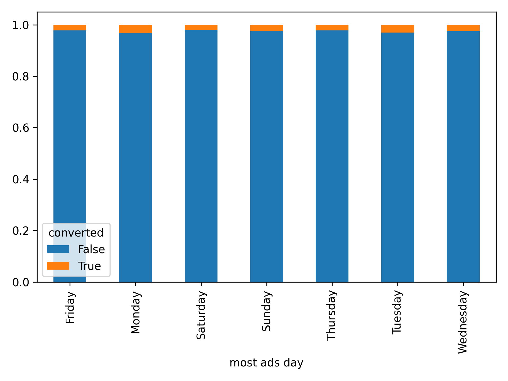

# A/B Testing Analysis

## Table of Contents
1. [Introduction](#introduction)
2. [Background](#background)
   - [Dataset Source](#dataset-source)
   - [Dataset Description](#dataset-description)
3. [Google Colab Notebook](#google-colab-notebook)
4. [Project Overview](#project-overview)
   - [Objectives](#objectives)
   - [Tools I Used](#tools-i-used)
1. [Introduction](#introduction)
2. [Dataset Description](#dataset-description)
3. [Exploratory Data Analysis (EDA)](#exploratory-data-analysis-eda)
4. [A/B Testing Analysis](#ab-testing-analysis)
5. [Results](#results)
6. [Conclusion](#conclusion)
7. [Code](#code)
8. [Dependencies](#dependencies)
9. [Usage](#usage)

## Introduction
📊 Dive into the world of A/B testing analysis with this project! We're exploring how different user exposures—ads versus PSAs—affect conversion rates and simulated revenue. Join me in analyzing the data to derive meaningful insights that drive strategic business decisions.

## Background
### Dataset Source
The dataset used in this project was sourced from Kaggle link*. It comprises data related to a marketing A/B testing scenario aimed at evaluating the effectiveness of advertising campaigns. A majority of the people in the sample were exposed to ads (the experimental group). And a small portion of people (the control group) instead saw a Public Service Announcement (PSA) in the exact size and place the ad would normally be. 

### Dataset Description
The dataset contains the following columns:
- `Unnamed: 0`: Row index
- `user id`: Unique identifier for each user
- `test group`: Specifies whether the user saw an advertisement ("ad") or a Public Service Announcement ("psa")
- `converted`: Indicates whether the user made a purchase (True) or not (False)
- `total ads`: Total number of advertisements seen by each user.
- `most ads day`: Day of the week when the user viewed the highest number of advertisements
- `most ads hour`: Hour of the day when the user viewed the highest number of advertisements

## Google Colab Notebook

This notebook contains the Python code used for the A/B testing analysis in this project. Click [here](link-to-your-notebook-file)* to view the notebook.

The notebook includes data preprocessing steps, visualizations, statistical analysis, and simulations related to evaluating the effectiveness of advertising campaigns using A/B testing.

## Project Overview
This project focuses on conducting an A/B testing analysis to evaluate the impact of ad exposure on conversion rates and simulated revenue. The primary objective is to gain familiarity with A/B testing methodologies and leverage data analysis techniques to assess the significance of experimental results. By simulating revenue based on conversion metrics and applying rigorous statistical tests, the project aims to uncover valuable insights that can guide strategic marketing decisions. Additionally, this project offered me a valuable opportunity to demonstrate my proficiency in Python, showcasing advanced analytical skills and the ability to create impactful data visualizations using key Python packages.

### Objectives
1. Identify peak days and hours of ad exposure for users.
2. Determine the day of the week and time of day with the highest conversion rates.
3. Assess if conversion rates vary significantly based on the day or hour of ad exposure.
4. Compare conversion rates between users exposed to ads and those in the control group.
5. Explore how the number of ads seen influences conversion likelihood.
6. Analyze simulated revenue differences between users who converted and those who did not.
7. Calculate the total revenue generated from users who converted during the ad campaign.

### Tools I Used
For my A/B testing analysis project, I utilized the following tools and platforms:

- **Python**: Used extensively for data preprocessing, statistical analysis, and creating visualizations.
- **Google Colab**: Leveraged for its cloud-based Python environment, ideal for running Jupyter notebooks and collaborating on projects.
- **Git and GitHub**: Employed for version control, enabling me to track changes, manage project iterations, and share my work with others.
- **NumPy and Pandas**: Essential Python libraries for data manipulation, allowing me to handle and analyze the dataset efficiently.
- **Matplotlib and Seaborn**: Used for data visualization, helping me create informative plots and charts to illustrate findings.
- **SciPy**: Utilized for statistical tests such as t-tests and Mann-Whitney U tests, crucial for evaluating experimental results.
  
This project enabled me to leverage my proficiency in Python programming, collaborative tools like Google Colab and GitHub, and essential data analysis and visualization libraries. These tools were instrumental in conducting rigorous A/B testing analysis and deriving meaningful insights from the dataset.

## Project Structure
1. **Data Preprocessing**
   - **Loading the Libraries**: Necessary libraries for data manipulation and analysis were imported.
   - **Loading the Data**: The dataset was loaded from the provided source into a pandas DataFrame.
   - **Dropping Unnecessary Columns**: Dropped the `Unnamed: 0` column as it is just a row index and does not contribute to the analysis. Also dropped the `user id` column after confirming there were no duplicate user IDs.
   - **Checking for Missing Values**: Verified that there were no missing values in the dataset.
   - **Variable Types and Levels**: Identified the types of variables in the dataset, primarily categorical with one numerical variable. `converted` is a boolean variable (the simplest type of categorical variable), indicating whether a user made a purchase. Despite initially appearing numerical, `most ads hour` is treated categorically with 24 distinct levels, where each hour of the day is represented (e.g., 20 corresponds to 8pm). `total ads` is the sole numerical variable, representing the count of advertisements shown to each user. Ensured categorical variables had appropriate levels (e.g., 7 levels for `most ads day`, covering each day of the week; 24 levels for `most ads hour`, spanning each hour of the day). Confirmed the correct definition of levels (e.g., no entries outside the 24-hour cycle for `most ads hour`).**edit?
```python
#import basic libraries
import numpy as np
import pandas as pd
import matplotlib.pyplot as plt
import seaborn as sns

#read the data
df = pd.read_csv("marketing_AB.csv")

#check if we have duplicates with respect to user id
num_duplicates = df.duplicated(subset = 'user id').sum()

#drop unwanted columns
df.drop(['Unnamed: 0', 'user id'], axis = 1, inplace = True)

#check for missing values
any_missing = df.isnull().values.any()

# Checking variable types and levels
print(df.dtypes) ***check this

#check if the categorical variables have appropriate number of levels
df_cat = df[['test group', 'converted', 'most ads day', 'most ads hour']]
df_cat.nunique()

#check if categorical variables have appropriately defined levels
for i in df_cat.columns:
  print(i.upper(), ":", df_cat[i].unique()) #gets us column names and the unique values
```

2. **Univariate Analysis**

   - **Test Group**: 
     - Created a count plot and pie chart for `test group`.
     - This dataset contains over 500,000 users, with 96% shown the ad and 4% shown the PSA.
       

   - **Conversion Rate**: 
     - Created a count plot and pie chart for `converted`.
     - Only 2.52% of users converted (bought the product), while 97.48% did not convert, indicating a very skewed distribution. This is not unexpected when dealing with A/B testing data.
       

   - **Most Ads Day**: 
     - Created a count plot (ordered from highest to lowest) and a pie chart for `most ads day`.
     - Friday had the most ads shown (15.75%), while Tuesday had the fewest (13.17%). The distribution is roughly similar across all days.
     - **Objective 1 Answered**: Identified peak days of ad exposure for users.
       

   - **Most Ads Hour**: 
     - Created a count plot (ordered from highest to lowest), a pie chart, and a chronological line plot for `most ads hour`.
     - The pie chart was less useful due to having 24 slices, but the count plot and line plot revealed that 1 pm had the most ads shown, while 4 am had the least.
     - **Objective 1 Answered**: Identified peak hours of ad exposure for users.
       

   - **Total Ads**: 
     - Created a histogram and box plot for `total ads`.
     - Due to skewness, the data was difficult to visualize, so descriptive statistics were examined:

       | Statistic     | Value        |
       |---------------|--------------|
       | count         | 588101       |
       | mean          | 24.820876    |
       | std           | 43.715181    |
       | min           | 1.000000     |
       | 25%           | 4.000000     |
       | 50%           | 13.000000    |
       | 75%           | 27.000000    |
       | max           | 2065.000000  |

     - Decided to focus on entries where the number of ads was less than 50 for better visualization.
     - Without these outliers, the median number of ads users saw was 10.

     #### Original Visualization:
     

     #### Refined Visualization (less than 50 ads):
     


```python
#univariate analysis

#test group
variable = 'test group' #which column in df_cat to visualize
#define the custom color palette
custom_palette = {'psa': 'orange', 'ad': '#add8e6'} #light blue color code
plt.figure(figsize = (8,4))
#count plot
plt.subplot (1,2,1) #1 row, 2 col, 1st plot
sns.countplot(x=variable, data=df_cat, palette = custom_palette)
plt.title(f'Count Plot - {variable}')
#pie chart
plt.subplot(1,2,2)
counts = df_cat[variable].value_counts() #counts of each unique variable in column we are visualizing
colors = [custom_palette[label] for label in counts.index]
plt.pie(counts, labels = counts.index, autopct = '%0.2f%%', colors = colors) #percentage with 2 decimal places
plt.title(f'Pie Chart - {variable}')
#adjust layout
plt.tight_layout()
#show the plots
plt.show()

#converted
variable = 'converted' #which column in df_cat to visualize
#ensure the values in 'converted' are strings, as the custom palette keys are strings
df_cat[variable] = df_cat[variable].astype(str)
#define the custom color palette
custom_palette = {'True': 'orange', 'False': '#add8e6'} #light blue color code
plt.figure(figsize = (8,4))
#count plot
plt.subplot (1,2,1) #1 row, 2 col, 1st plot
sns.countplot(x=variable, data=df_cat, palette = custom_palette)
plt.title(f'Count Plot - {variable}')
#pie chart
plt.subplot(1,2,2)
counts = df_cat[variable].value_counts() #counts of each unique variable in column we are visualizing
colors = [custom_palette[label] for label in counts.index]
plt.pie(counts, labels = counts.index, autopct = '%0.2f%%', colors = colors) #percentage with 2 decimal places
plt.title(f'Pie Chart - {variable}')
#adjust layout
plt.tight_layout()
#show the plots
plt.show()

#most ads day
variable = 'most ads day' #which column in df_cat to visualize
#define the custom color palette
custom_palette = {
    'Monday': '#FF6666',    # Red
    'Tuesday': '#FF66B2',   # Pink
    'Wednesday': '#66CC66', # Green
    'Thursday': '#FF9933',  # Orange
    'Friday': '#3399FF',    # Blue
    'Saturday': '#8C8CFF',  # Purple
    'Sunday': '#FFFF66'     # Yellow
}
plt.figure(figsize = (9,5))
#count plot
plt.subplot (1,2,1) #1 row, 2 col, 1st plot
sns.countplot(x=variable, data=df_cat, palette= custom_palette, 
              order = df_cat['most ads day'].value_counts().index) #highest to lowest
plt.title(f'Count Plot - {variable}')
plt.xticks(rotation = 90) #rotate day names for easier reading
#pie chart
plt.subplot(1,2,2)
counts = df_cat[variable].value_counts() #counts of each unique variable in column we are visualizing
colors = [custom_palette[label] for label in counts.index]
plt.pie(counts, labels = counts.index, autopct = '%0.2f%%', colors = colors) #percentage with 2 decimal places
plt.title(f'Pie Chart - {variable}')
#adjust layout
plt.tight_layout()
#show the plots
plt.show()

#most ads hour
variable = 'most ads hour' #which column in df_cat to visualize
#define the custom color palette (adjust as needed)
custom_palette = ['#1f77b4'] * 24  # Using a single color for all bars
plt.figure(figsize = (9,5)) #12,6
#count plot
plt.subplot (2,2,1) #2 rows, 2 cols, 1st plot in 2x2, top left
sns.countplot(x=variable, data=df_cat, palette= custom_palette, 
              order = df_cat['most ads hour'].value_counts().index) #highest to lowest
plt.title(f'Count Plot - {variable}')
plt.xticks(rotation = 45) #rotate day names for easier reading
#pie chart
plt.subplot(2,2,2)
counts = df_cat[variable].value_counts() #counts of each unique variable in column we are visualizing
colors = [custom_palette[label] for label in counts.index]
plt.pie(counts, labels = counts.index, autopct = '%0.2f%%', colors = colors) #percentage with 2 decimal places
plt.title(f'Pie Chart - {variable}')
#line plot
plt.subplot (2,1,2) #2 rows, 1 column in, 2 (bottom row)
sns.lineplot(x=range(24), y=df_cat.groupby(variable).size(), marker='o', color='#1f77b4')
plt.title(f'Count of Ads by Hour of the Day')
plt.xlabel('Hour of the Day')
plt.ylabel('Count')
# Customize x-axis ticks and labels
plt.xticks(range(24), labels=[str(i) for i in range(24)], rotation=45)
#adjust layout
plt.tight_layout()
#show the plots
plt.show()

#total ads
variable = 'total ads' #the only numerical variable
plt.figure(figsize = (6,4))
#histogram
plt.subplot(1,2,1)
sns.histplot(x=variable, data=df)
plt.title(f'Histogram - {variable}')
#box plot chart
plt.subplot(1,2,2)
sns.boxplot(y = variable, data = df)
plt.title(f'Boxplot - {variable}')
#adjust layout
plt.tight_layout()
#show the plots
plt.show()

#descriptive stats for total ads
df['total ads'].describe()

#second total ads visualizations (focus on entries where the number of ads is less than 50)
variable = 'total ads' #the only numerical variable
plt.figure(figsize = (6,4))
#histogram
plt.subplot(1,2,1)
#filtering the data for a value close to 75th percentile only for better visualization
sns.histplot(x=variable, data=df[df['total ads']<50])
plt.title(f'Histogram - {variable}')
#pie chart
plt.subplot(1,2,2)
sns.boxplot(y = variable, data=df[df['total ads']<50])
plt.title(f'Boxplot - {variable}')
#adjust layout
plt.tight_layout()
#show the plots
plt.show()
```
3. **Bivariate Analysis**

   - **Test Group vs Converted**: 
     - Investigated the relationship between `test group` and `converted`.
     - Normalized a crosstab to show percentages. Among users exposed to the ad, 2.55% made a purchase, while among those exposed to the PSA, only 1.79% converted.
     - **Objective 4 Answered**: Compared conversion rates between users exposed to ads and those in the control group (PSA).
       
       | Test Group | Not Converted   | Converted      |
         |--------------|---------|-----------|
         | Ad      | 0.974453| 0.025547  |
         | PSA      | 0.982146| 0.017854 |
       
       

   - **Most Ads Day vs Converted**: 
     - Investigated the relationship between `most ads day` and `converted`.
     - Created a crosstab and normalized it to show percentages. Monday showed the highest conversion rate at 3.28%.
     - **Objective 2 Answered**: Determined the day of the week with the highest conversion rate.

         | Most Ads Day | Not Converted   | Converted      |
         |--------------|---------|-----------|
         | Monday       | 0.967188| 0.032812  |
         | Tuesday      | 0.970160| 0.029840  |
         | Wednesday    | 0.975058| 0.024942  |
         | Sunday       | 0.975524| 0.024476  |
         | Friday       | 0.977788| 0.022212  |
         | Thursday     | 0.978429| 0.021571  |
         | Saturday     | 0.978949| 0.021051  |

       

   - **Most Ads Hour vs Converted**: 
     - Investigated the relationship between `most ads hour` and `converted`.
     - Created a crosstab and normalized it to show percentages. 4pm had the highest conversion rate at 3.08%.
     - **Objective 2 Answered**: Determined the time of day with the highest conversion rate.
       
       | Most Ads Hour | Not Converted   | Converted      |
         |--------------|---------|-----------|
         | 16             | 0.969228  | 0.030772  |
         | 20             | 0.970197  | 0.029803  |
         | 15             | 0.970347  | 0.029653  |
         | 21             | 0.971077  | 0.028923  |
         | 17             | 0.971790  | 0.028210  |
         | 14             | 0.971937  | 0.028063  |
         | 18             | 0.972620  | 0.027380  |
         | 19             | 0.973280  | 0.026720  |
         | 22             | 0.973895  | 0.026105  |
         | 13             | 0.975323  | 0.024677  |
         | 12             | 0.976172  | 0.023828  |
         | 23             | 0.977338  | 0.022662  |
         | 6              | 0.977756  | 0.022244  |
         | 11             | 0.977884  | 0.022116  |
         | 10             | 0.978479  | 0.021521  |
         | 5              | 0.979085  | 0.020915  |
         | 8              | 0.980484  | 0.019516  |
         | 9              | 0.980809  | 0.019191  |
         | 0              | 0.981575  | 0.018425  |
         | 7              | 0.981889  | 0.018111  |
         | 4              | 0.984765  | 0.015235  |
         | 1              | 0.987089  | 0.012911  |
         | 3              | 0.989548  | 0.010452  |
         | 2              | 0.992687  | 0.007313  |
       
       

   - **Total Ads vs Converted**: 
     - Investigated the relationship between `total ads` and `converted`.
     - Created a boxplot to compare distributions. Filtered for ads less than 50 due to visualization issues identified earlier. For users who converted, the median number of ads seen was around 25, compared to 10 for those who did not convert. Repeated targetting seems to be helping with conversion rates.
     - **Objective 5 Answered**: Explored how the number of ads seen influenced conversion likelihood.
       #### Original Visualization
       
       #### Refined Visualization (less than 50 ads):
       

```python
#bivariate analysis

#test group vs converted
#comparing two categorical variables
#also normalized them
ct_conversion_test_group = pd.crosstab(df['test group'], df['converted'], normalize = 'index')
ct_conversion_test_group
#visualizing above
ct_conversion_test_group.plot.bar(stacked = True);

#most ads day vs converted
ct_conversion_day = pd.crosstab(df['most ads day'], df['converted'], normalize = 'index')
print(ct_conversion_day.sort_values(by = True, ascending = False))
ct_conversion_day.plot.bar(stacked = True);
plt.tight_layout()

#most ads hour vs converted
ct_conversion_hour = pd.crosstab(df['most ads hour'], df['converted'], normalize = 'index')
print(ct_conversion_hour.sort_values(by = True, ascending = False))
ct_conversion_hour.plot.bar(stacked = True);

#total ads vs converted
sns.boxplot(x = 'converted', y = 'total ads', data = df);

#total ads less than 50 vs converted
#define the custom color palette
custom_palette = {'True': 'orange', 'False': '#add8e6'}  # Light blue color code
sns.boxplot(x = 'converted', y = 'total ads', data = df[df['total ads']<50], palette = custom_palette);

```

4. **Statistical Tests**
   - Conducting hypothesis tests (e.g., t-tests, Mann-Whitney U tests) to assess the significance of observed differences.
   - Interpreting p-values and making conclusions based on statistical significance.

5. **Simulated Revenue Analysis**
   - **Data Modification:**
     - Simulating a `simulated_revenue` column based on conversion status and ad exposure.
   - **Univariate Analysis:**
     - Examining the distribution and summary statistics of `simulated_revenue`.
   - **Bivariate Analysis:**
     - Exploring relationships between `converted` and `simulated_revenue`.
     - Analyzing how `simulated_revenue` varies across different factors like `test group` or `total ads`.
   - **Statistical Tests:**
     - Performing tests to compare `simulated_revenue` between converted and non-converted groups.
     - Discussing the implications for potential business decisions.

## Insights and Interpretation
- Summarize the key findings from both the initial A/B testing analysis and the simulated revenue analysis.
- Interpret the results in the context of the project's objectives and discuss their theoretical implications for business strategies.

## Conclusion
- Reflect on the project's goals and what was achieved through the analysis.
- Discuss any limitations encountered and opportunities for further exploration or refinement.

## Visualizations and Code
- Include visualizations (e.g., plots, charts) that highlight key insights.
- Provide snippets of code used for data preprocessing, analysis, and statistical tests.

------

# A/B Testing Analysis Project README

## Overview
This project aims to conduct an A/B testing analysis to evaluate the effectiveness of an advertising campaign in increasing user conversion rates. The analysis focuses on comparing two groups: one exposed to advertisements (experimental group) and another exposed to Public Service Announcements (PSAs) or no exposure (control group). The primary goal is to determine if there is a statistically significant difference in conversion rates between these groups.

## Data Description
The dataset used in this analysis includes the following variables:
- **test group**: Indicates whether users were in the experimental (ad exposure) or control (PSA/no exposure) group.
- **converted**: Binary variable indicating if the user converted (True) or did not convert (False).
- **total ads**: Number of ads each user was exposed to during the campaign.
- **most ads day**: Day of the week when the user saw the most ads.
- **most ads hour**: Hour of the day when the user saw the most ads.

## Project Structure
1. **Data Preprocessing**
   - Cleaned and prepared the dataset, handling missing values and ensuring data integrity.
   - Converted categorical variables into appropriate formats for analysis.

2. **Exploratory Data Analysis**
   - Conducted univariate analysis to understand the distribution of variables.
   - Visualized relationships between variables using histograms, bar plots, and scatter plots.

3. **Hypothesis Testing**
   - **Assumptions Check:**
     - Tested for normality and equality of variances using Shapiro-Wilk and Levene's tests.
   - **Statistical Tests:**
     - Used independent two-sample t-tests to compare conversion rates between the experimental and control groups.
     - Applied non-parametric Mann-Whitney U tests as alternatives when assumptions for t-tests were not met.

4. **Simulated Revenue Analysis**
   - **Data Transformation:**
     - Simulated a `simulated_revenue` column based on conversion status and total ads exposure.
   - **Revenue Analysis:**
     - Analyzed the distribution and statistical significance of simulated revenue differences between converted and non-converted groups.

5. **Insights and Interpretation**
   - Summarized findings from the A/B testing and simulated revenue analyses.
   - Interpreted results to derive theoretical business insights, including implications for marketing strategies and revenue generation.

## Conclusion
- Concluded with insights into the effectiveness of the advertising campaign based on statistical evidence.
- Discussed limitations of the analysis and suggestions for future research or improvements.

## Visualizations and Code
- Included visualizations such as histograms, box plots, and statistical tests' output.
- Provided snippets of Python code used for data preprocessing, analysis, and visualization.

## Future Steps
- Suggested next steps for further exploring the data or refining the analysis methodology.
- Proposed additional experiments or data collection efforts to strengthen the analysis conclusions.

## Acknowledgments
This project was inspired by a YouTube tutorial on analyzing A/B testing data. While the initial analysis approach followed the tutorial, additional visualizations and a simulated revenue column were added to further explore the dataset and derive business insights.

Tutorial Link: YouTube - Analyzing A/B Testing Data

## Future Steps
- Outline potential next steps for enhancing the analysis or applying findings in real-world scenarios.
- Consider additional experiments or refinements to improve the accuracy and reliability of results.

